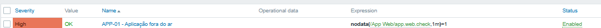

# ⚙️ Implementação Zabbix (Modelo de Monitoramento)

Este documento mostra como os alertas definidos no catálogo são aplicados na prática e como podem ser testados manualmente em um ambiente local.

A ideia aqui não é configuração real do Zabbix ainda, mas sim demonstrar como o monitoramento funcionaria na prática.

---

## 🧠 Relação com o projeto

No projeto existem três camadas principais:

- SLA define o limite aceitável do serviço
- Catálogo de alertas define o problema (ex: APP-01)
- Implementação Zabbix mostra como esse problema seria detectado

---

## 🔁 Como o monitoramento funciona

Todo serviço segue a mesma lógica:

- Item → coleta o dado (ex: HTTP, porta, disco)
- Trigger → regra que detecta falha
- Teste → forma manual de validar o comportamento

---

## 🌐 APP-01 — Aplicação fora do ar (P1)

O que significa: a aplicação não responde ou retorna erro.

Trigger:
`nodata(/App Web/app.web.check,1m)=1`

Teste manual:
`curl -I http://localhost`

Interpretação:
- 200 → sistema funcionando
- 500 ou sem resposta → falha detectada

---

## 🟡 APP-02 — Lentidão da aplicação (P2)

O que significa: a aplicação está funcionando, mas lenta.

Trigger:
`last(/App Web/app.web.response.time)>3`

Teste manual:
`curl -w "%{time\_total}\\n" http://localhost`

Interpretação:
- até 3s → normal
- acima de 3s → degradação

---

## 🗄️ DB-01 — Banco de dados fora do ar (P1)

O que significa: o banco não está acessível.

Trigger:
`last(/PostgreSQL/net.tcp.service[tcp,postgres,5432])=0`

Teste manual:
`nc -zv localhost 5432`

Interpretação:
- succeeded → banco ativo
- failed → banco indisponível

---

## 🟡 DB-02 — Uso alto de disco (P2)

O que significa: risco de falta de armazenamento.

Trigger:
`last(/PostgreSQL/vfs.fs.size[/,pused])>85`

Teste manual:
`df -h`

Interpretação:
- abaixo de 85% → ok
- acima de 85% → alerta

---

## 🌐 NGINX-01 — Entrada do sistema fora do ar (P1)

O que significa: o ponto de entrada do sistema não responde.

Trigger:
`nodata(/Nginx/nginx.http.check,1m)=1`

Teste manual:
`curl -I https://localhost`

Interpretação:
- responde → sistema ok
- sem resposta → falha crítica

---

## 📡 MON-01 — Monitoramento fora do ar (P3)

O que significa: perda de visibilidade do ambiente.

Trigger:
`nodata(/Zabbix server/agent.ping,3m)=1`

Teste manual:
`systemctl status zabbix-server` ou `docker ps`

Interpretação:
- ativo → monitoramento funcionando
- parado → sistema sem visibilidade

---

## 🎯 Conclusão

Este documento conecta os SLAs, os alertas e a forma prática de detecção.

Ele simula como um ambiente de monitoramento real funciona em operações de infraestrutura e NOC.