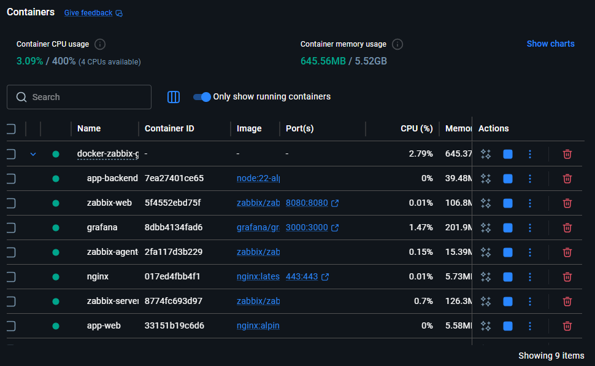
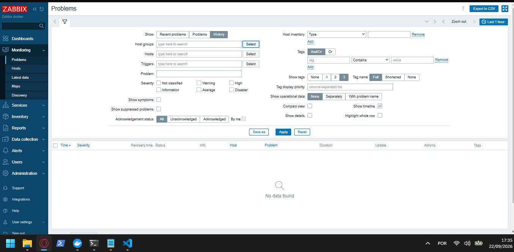
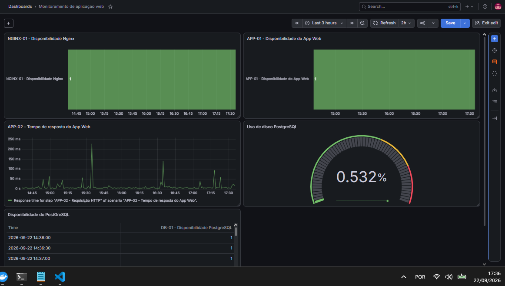
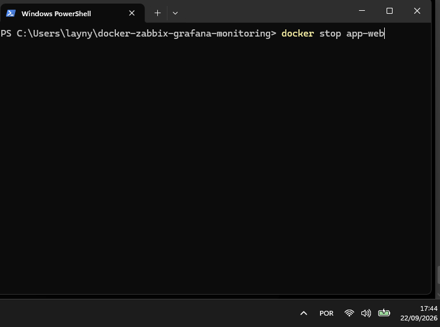
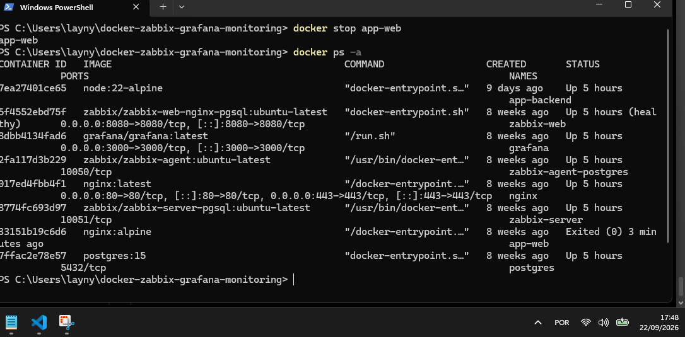
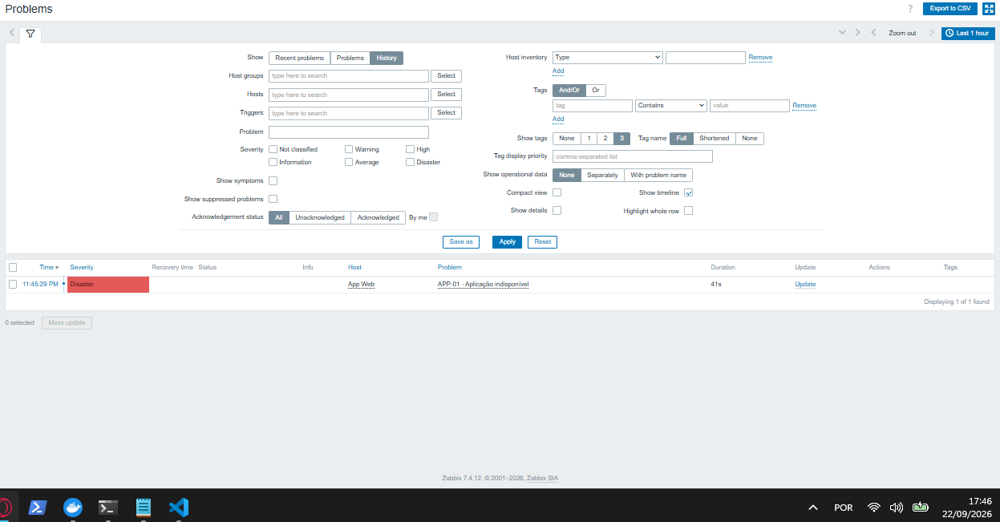
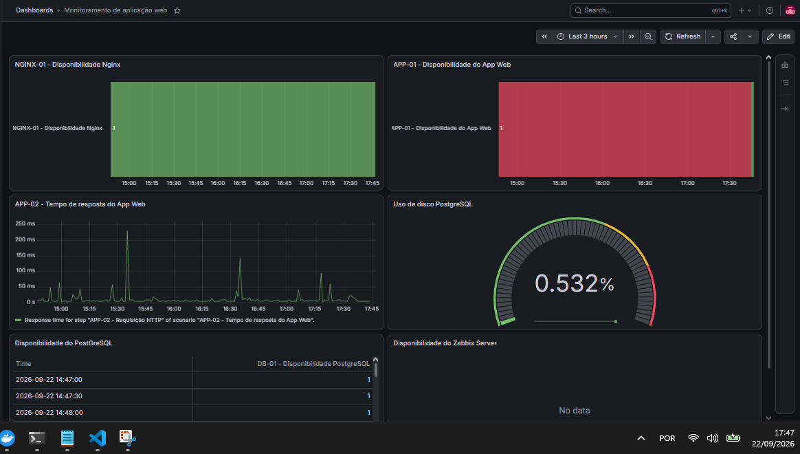
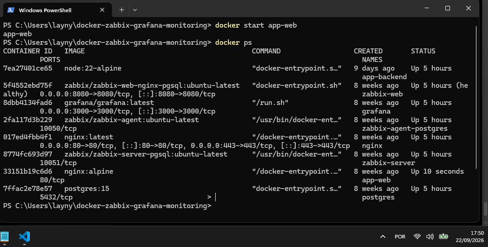
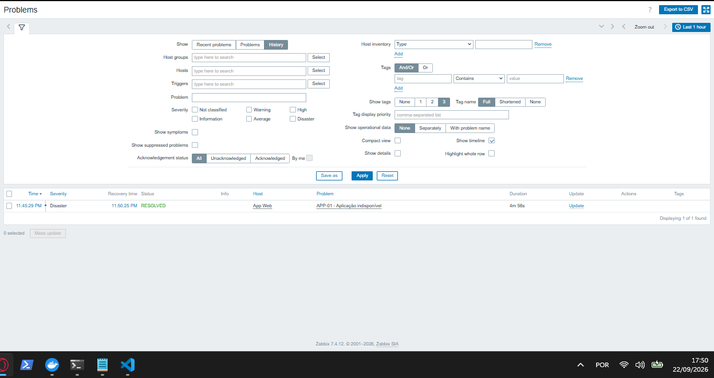
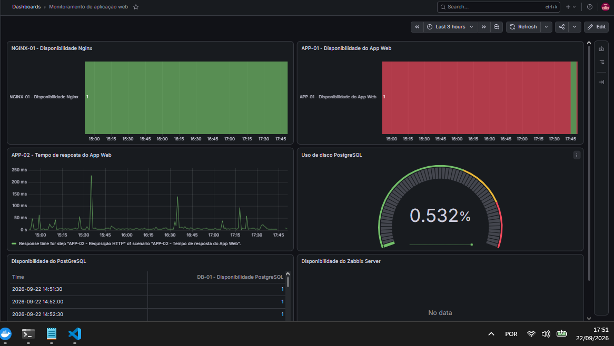

# 🚨 INC-001 — Indisponibilidade do App Web

## 📋 Identificação

| Campo               | Informação                   |
| ------------------- | ---------------------------- |
| **ID**              | INC-001                      |
| **Incidente**       | Indisponibilidade do App Web |
| **Serviço afetado** | `app-web`                    |
| **Ambiente**        | Docker                       |
| **Monitoramento**   | Zabbix                       |
| **Observabilidade** | Grafana                      |
| **Tipo**            | Indisponibilidade            |
| **Natureza**        | Simulação controlada         |
| **Status**          | ✅ Resolvido                  |

---

## 🎯 Objetivo

Simular a indisponibilidade do serviço `app-web` e validar o comportamento do ambiente de monitoramento diante da interrupção do serviço.

A simulação teve como objetivo verificar:

* detecção da indisponibilidade pelo Zabbix;
* geração do Problem correspondente;
* visualização do incidente no Grafana;
* comportamento do container durante a falha;
* recuperação do serviço;
* normalização do monitoramento após a recuperação.

---

## 🟢 1. Estado inicial

Antes da simulação, o ambiente encontrava-se operacional.

Os containers estavam em execução e tanto o Zabbix quanto o Grafana apresentavam o ambiente em estado normal.

### Evidências







---

## 💥 2. Falha simulada

A indisponibilidade foi provocada de forma controlada através da interrupção do container responsável pelo serviço web:

```bash
docker stop app-web
```

O comando foi executado com registro do horário da simulação.

### Evidência



---

## 🔴 3. Detecção do incidente

Após a interrupção do serviço, o estado do ambiente foi verificado e o `app-web` encontrava-se indisponível.

### Evidência do container



O Zabbix identificou a indisponibilidade e registrou o evento como **Problem**.

### Evidência — Zabbix



O incidente também foi refletido no Grafana através do monitoramento configurado para o ambiente.

### Evidência — Grafana



---

## 🔎 4. Investigação

A análise confirmou que a indisponibilidade estava relacionada à interrupção intencional do container `app-web`.

O estado do container foi verificado durante o incidente, confirmando que o serviço permanecia parado.

A correlação entre:

```text
Interrupção do container
       ↓
Indisponibilidade do serviço
       ↓
Detecção pelo Zabbix
       ↓
Problem
       ↓
Visualização no Grafana
```

permitiu validar o funcionamento do fluxo de monitoramento.

---

## 🛠️ 5. Tratamento

Como se tratava de uma falha simulada, o tratamento consistiu na restauração do serviço interrompido.

O container foi iniciado novamente através do comando:

```bash
docker start app-web
```

### Evidência



---

## ✅ 6. Recuperação

Após a inicialização do `app-web`, o serviço voltou a operar normalmente.

O Zabbix identificou a recuperação e o evento anteriormente registrado como Problem foi resolvido.

### Evidência — Zabbix



O Grafana também voltou a apresentar o serviço em estado normal.

### Evidência — Grafana



---

## 📊 7. Validação

Após a recuperação, o ambiente foi novamente verificado.

O Zabbix e o Grafana retornaram ao estado operacional esperado, confirmando a normalização do monitoramento.

### Evidências finais


---

## 🧾 8. Resultado

A simulação confirmou o funcionamento do fluxo de monitoramento para uma indisponibilidade do serviço `app-web`.

O incidente percorreu o ciclo:

```text
Estado normal
     ↓
Falha controlada
     ↓
Indisponibilidade
     ↓
Detecção pelo Zabbix
     ↓
Problem
     ↓
Observação no Grafana
     ↓
Restauração do serviço
     ↓
Problem resolvido
     ↓
Validação
```

O serviço foi restaurado e o ambiente retornou ao estado operacional esperado.

---

## 📝 9. Observações

A simulação foi realizada de forma controlada em ambiente de laboratório.

As evidências apresentadas neste registro foram coletadas durante a execução do incidente e representam o comportamento observado no ambiente no momento da simulação.