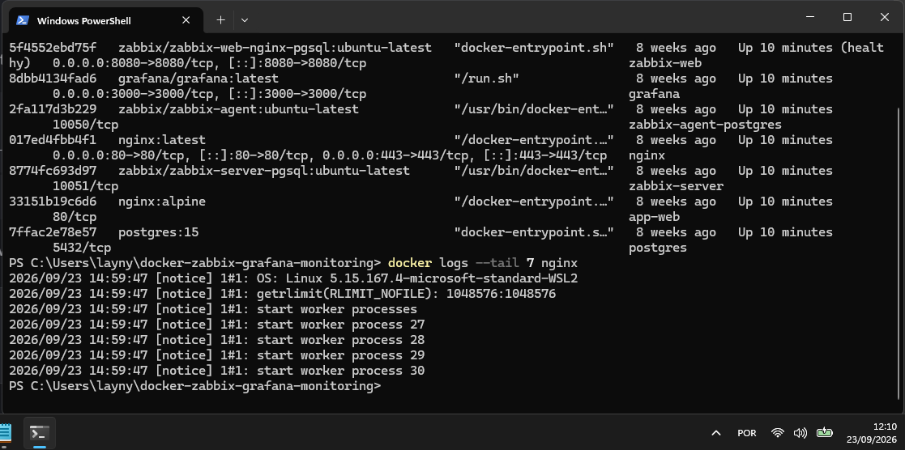
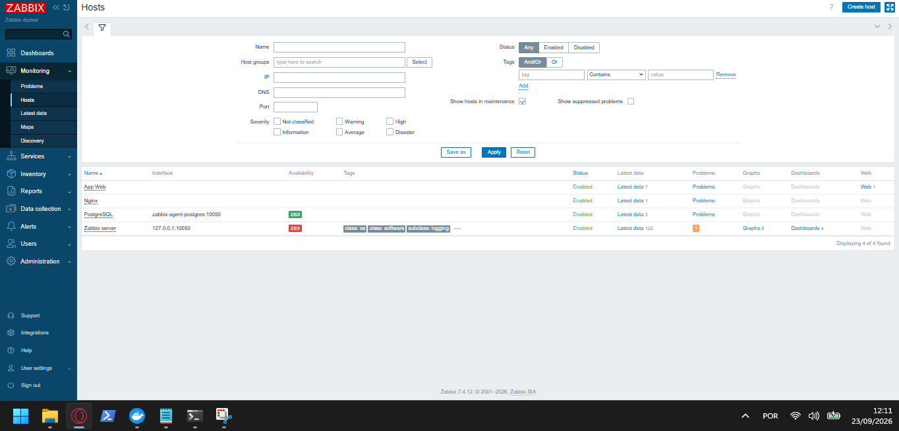
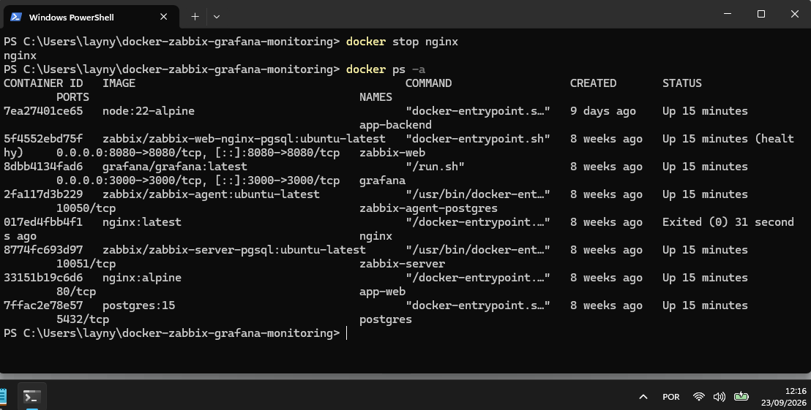
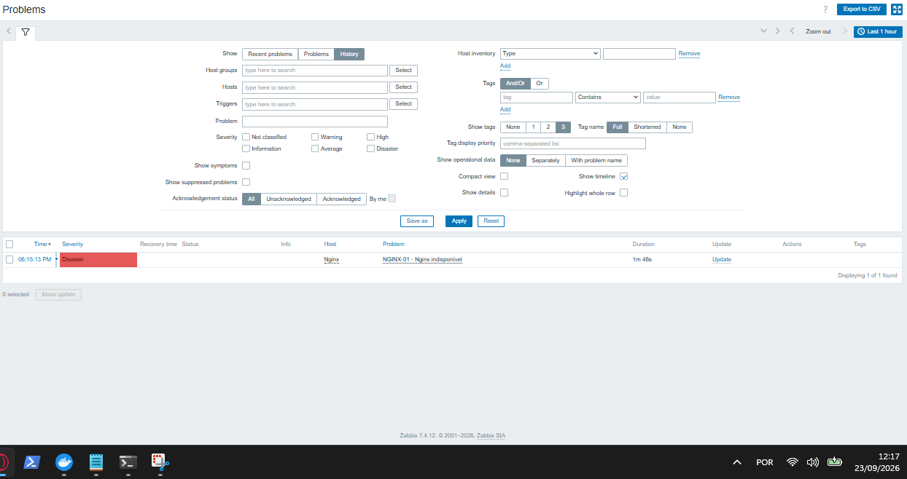
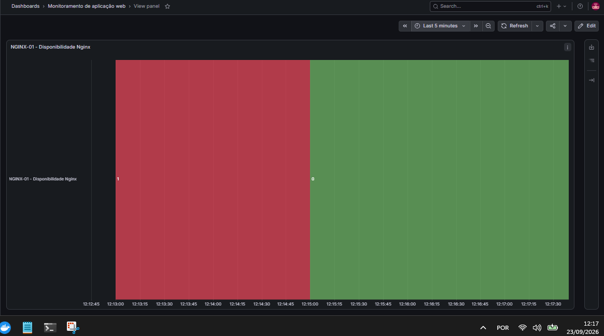
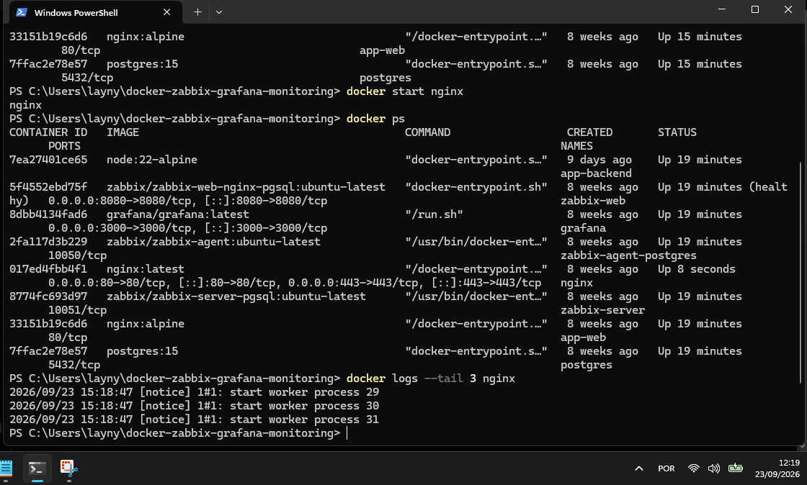
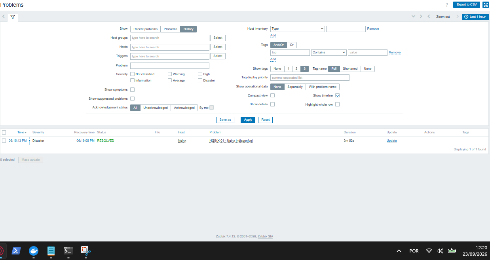
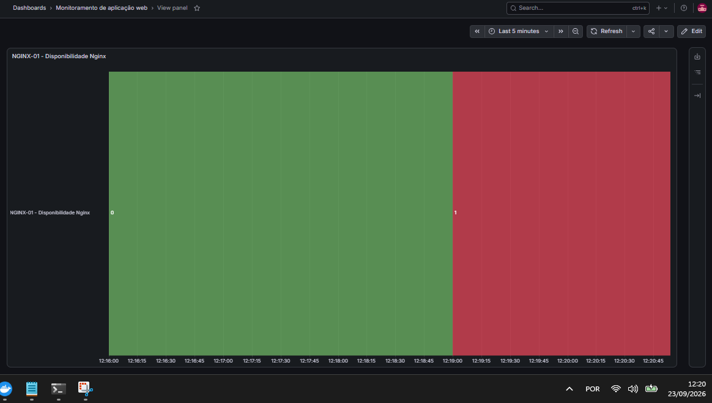

---

# 🚨 INC-002 — Indisponibilidade do Nginx / Reverse Proxy

## Relatório de Simulação de Incidente

**Ambiente:** Docker | Zabbix | Grafana

---

## 📋 Identificação do Incidente

| Campo               | Informação                                 |
| ------------------- | ------------------------------------------ |
| **ID**              | INC-002                                    |
| **Incidente**       | Indisponibilidade do Nginx / Reverse Proxy |
| **Serviço afetado** | `nginx`                                    |
| **Ambiente**        | Docker                                     |
| **Monitoramento**   | Zabbix                                     |
| **Observabilidade** | Grafana                                    |
| **Status**          | ✅ Resolvido                                |

---

## 🎯 Objetivo da Simulação

Validar o comportamento do ecossistema de monitoramento diante da interrupção controlada do serviço **Nginx**, responsável pela camada de entrada e encaminhamento das requisições da aplicação.

**Métricas avaliadas:**

* Detecção da indisponibilidade pelo Zabbix.
* Geração do alerta de **Problem**.
* Reflexo da indisponibilidade nos dashboards do Grafana.
* Comportamento do ambiente durante a interrupção.
* Processo de recuperação e normalização do serviço.

---

## 🟢 1. Estado Inicial do Ambiente

Antes da simulação, a infraestrutura operava dentro dos parâmetros de normalidade esperados.

### Evidências de Normalidade:



---

### Monitoramento Inicial (Zabbix)



---

### Observabilidade Inicial (Grafana)


---

## 💥 2. Falha Simulada

A indisponibilidade foi provocada de forma controlada através da interrupção do container responsável pelo Nginx:

```bash
docker stop nginx
```

A interrupção foi realizada de forma controlada para simular a indisponibilidade da camada de entrada da aplicação.

Após a ação, o container do Nginx passou para o estado de interrupção.



---

## 🔴 3. Detecção do Incidente

O Zabbix identificou a indisponibilidade do serviço através do item configurado para verificar a disponibilidade TCP da porta 80:

```text
net.tcp.service[tcp,nginx,80]
```

A falha na verificação resultou na geração de um evento **Problem**, indicando a indisponibilidade do serviço monitorado.

### Alerta Gerado:



---

### Painel de Observabilidade

O impacto do incidente também foi refletido no Grafana, permitindo visualizar a alteração do estado monitorado durante a indisponibilidade.



---

## 🔎 4. Fluxo de Investigação

Análise do fluxo lógico percorrido pelo incidente:

```text
Interrupção controlada do Nginx
       ↓
Indisponibilidade do serviço
       ↓
Falha na verificação TCP da porta 80
       ↓
Detecção pelo Zabbix
       ↓
Geração do Problem
       ↓
Visualização no Grafana
```

A correlação entre o estado do container e os eventos apresentados nas ferramentas de monitoramento permitiu validar o comportamento da infraestrutura durante a falha.

---

## 🛠️ 5. Tratamento do Incidente

A ação de recuperação consistiu na inicialização do container do Nginx:

```bash
docker start nginx
```

A inicialização restabeleceu o serviço responsável pela camada de entrada da aplicação.



---

## ✅ 6. Recuperação e Normalização

Após a recuperação do Nginx, o monitoramento reconheceu o retorno do serviço ao estado operacional.

### Monitoramento Normalizado



O Grafana também retornou ao estado esperado após a recuperação do serviço.



---

## 📊 7. Validação Final

O ambiente retornou com sucesso ao seu estado estável, encerrando o ciclo do incidente.

A recuperação foi validada através do retorno do Nginx à operação e da normalização apresentada pelas ferramentas de monitoramento e observabilidade.

---

## 🧾 8. Conclusão

* A simulação validou a detecção de uma indisponibilidade controlada do Nginx através do monitoramento TCP configurado no Zabbix.
* O evento foi refletido na camada de observabilidade do Grafana.
* O serviço foi recuperado através da reinicialização do container.
* O ciclo de detecção, tratamento e normalização foi validado no ambiente de laboratório.

---

*Fim da Apresentação — Relatório INC-002*