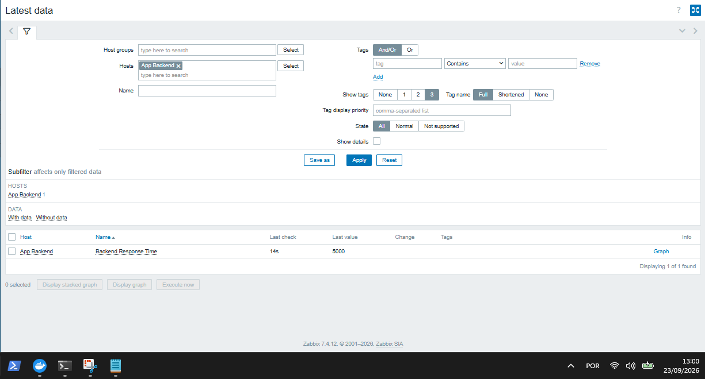
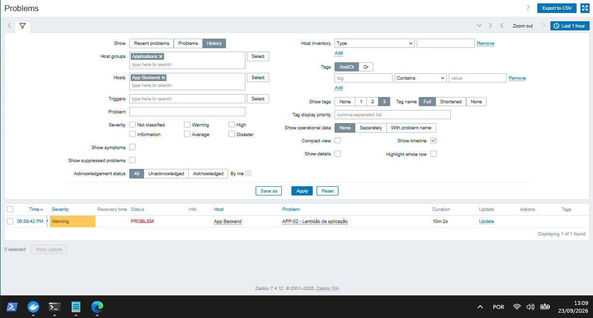
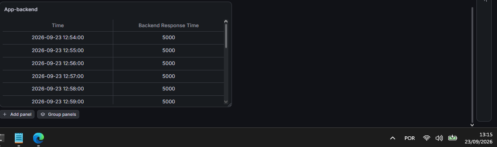
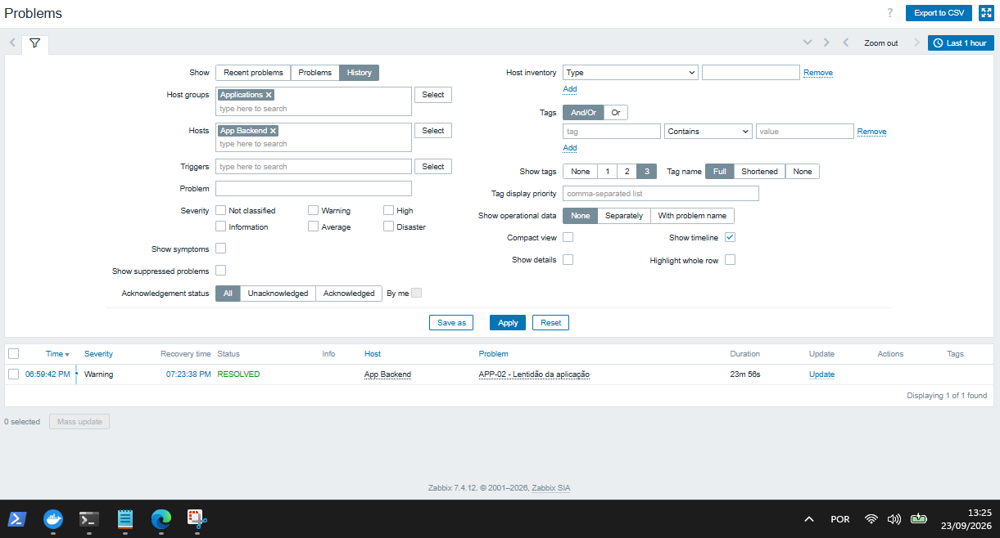
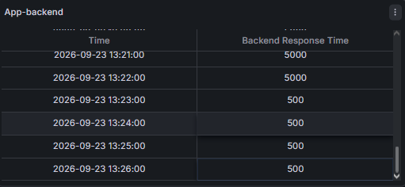

# 🚨 INC-003 — Lentidão da Aplicação Backend

## Relatório de Simulação de Incidente

**Ambiente:** Docker | Zabbix + Grafana

---

## 📋 Identificação do Incidente

| Campo               | Informação                    |
| ------------------- | ----------------------------- |
| **ID**              | INC-003                       |
| **Incidente**       | Lentidão da Aplicação Backend |
| **Serviço afetado** | `app-backend`                 |
| **Ambiente**        | Docker                        |
| **Monitoramento**   | Zabbix                        |
| **Observabilidade** | Grafana                       |
| **Status**          | ✅ Resolvido                   |

---

## 🎯 Objetivo da Simulação

Validar a capacidade do ambiente de monitoramento de detectar uma degradação de desempenho no **App Backend**, gerar o alerta correspondente e reconhecer a normalização do serviço após a recuperação.

**Métricas avaliadas:**

* Detecção da degradação pelo Zabbix.
* Geração do alerta pela trigger de tempo de resposta.
* Comportamento do indicador de latência no Grafana.
* Processo de recuperação e normalização.

---

## 🟢 1. Estado Inicial do Ambiente

Antes da simulação, o **App Backend** encontrava-se operacional e configurado no Zabbix para monitoramento por meio de um item do tipo **HTTP agent**.

O item monitorado foi configurado como:

```text
Nome: Backend Response Time
Key: backend.response.time
Tipo: HTTP agent
Endpoint: http://app-backend:3000/slow
```

A trigger utilizada para identificação da degradação foi:

```text
last(/App Backend/backend.response.time)>3000
```

Valores de até **3000 ms** foram considerados dentro do limite definido para o cenário. Valores superiores a esse limite caracterizam lentidão da aplicação.

---

### Evidências de Normalidade

---

### Monitoramento Inicial (Zabbix)



---

## 💥 2. Falha Simulada

A instabilidade foi provocada de forma controlada através da chamada ao endpoint de lentidão da aplicação:

```bash
curl "http://localhost/api/slow?delay=5000"
```

A aplicação respondeu indicando um atraso de:

```text
5000ms
```

O valor ultrapassou o limite de **3000 ms** definido na trigger `APP-02 - Lentidão da aplicação`, caracterizando uma degradação controlada do serviço.

---

## 🔴 3. Detecção do Incidente

O Zabbix identificou o tempo de resposta acima do limite configurado e acionou a trigger:

```text
APP-02 - Lentidão da aplicação
```

A condição responsável pelo alerta foi:

```text
last(/App Backend/backend.response.time)>3000
```

Com o valor monitorado em **5000 ms**, o incidente foi apresentado no Zabbix como **PROBLEM**, com severidade **Warning**.

---

### Alerta Gerado



---

### Painel de Observabilidade

O Grafana registrou a degradação do tempo de resposta do App Backend, apresentando valores de **5000 ms** durante o período do incidente.



---

## 🔎 4. Fluxo de Investigação

Análise do fluxo lógico percorrido pelo incidente:

```text
Requisição ao endpoint /api/slow?delay=5000
       ↓
Tempo de resposta elevado — 5000 ms
       ↓
Zabbix coleta o valor pelo HTTP agent
       ↓
Trigger APP-02 identifica valor > 3000 ms
       ↓
Evento PROBLEM
       ↓
Grafana evidencia a degradação
```

A análise conjunta do Zabbix e do Grafana permitiu confirmar que o incidente estava relacionado à **degradação do tempo de resposta**, e não à indisponibilidade completa do App Backend.

---

## 🛠️ 5. Tratamento do Incidente

Para validar a recuperação do cenário, o endpoint monitorado foi temporariamente ajustado para utilizar um atraso controlado de **500 ms**:

```text
http://app-backend:3000/slow?delay=500
```

A nova coleta apresentou o valor:

```text
500 ms
```

O valor ficou abaixo do limite de **3000 ms** definido na trigger, permitindo validar a normalização do indicador monitorado.

---

## ✅ 6. Recuperação e Normalização

Após a normalização do tempo de resposta, o Zabbix identificou que a condição da trigger deixou de ser satisfeita e o incidente foi encerrado como **RESOLVED**.

A coleta apresentou a redução do tempo de resposta de:

```text
5000 ms
↓
500 ms
```

---

### Monitoramento Normalizado



---

## 📊 7. Validação Final

O ambiente retornou ao estado esperado para o cenário, com o tempo de resposta abaixo do limite definido.

O Grafana registrou a normalização do indicador do App Backend.



---

### Resultado da validação

| Condição     | Tempo de resposta | Resultado           |
| ------------ | ----------------: | ------------------- |
| Degradação   |           5000 ms | 🔴 Acima do limite  |
| Normalização |            500 ms | 🟢 Dentro do limite |

O ciclo do incidente foi concluído com a detecção da degradação, geração do alerta, acompanhamento da métrica e reconhecimento da recuperação.

---

## 🧾 8. Conclusão

* A simulação demonstrou a capacidade do Zabbix de identificar degradação de desempenho no App Backend através do monitoramento do tempo de resposta.
* A trigger `APP-02 - Lentidão da aplicação` permitiu diferenciar uma condição de lentidão de uma indisponibilidade completa do serviço.
* O Grafana complementou a análise ao apresentar a evolução do tempo de resposta durante o incidente.
* Após a normalização para **500 ms**, o alerta foi encerrado e o ambiente retornou ao estado esperado.
* O cenário validou o fluxo de **detecção → investigação → tratamento → recuperação → validação** utilizando Zabbix e Grafana.

---
